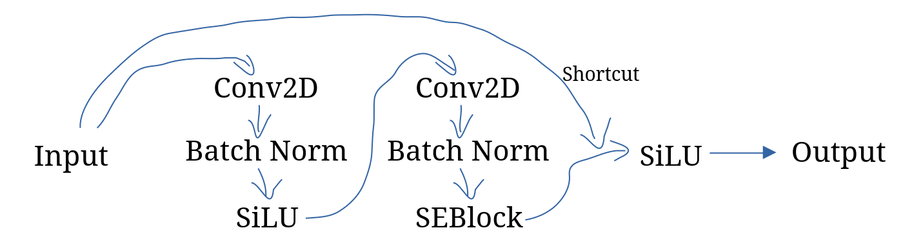
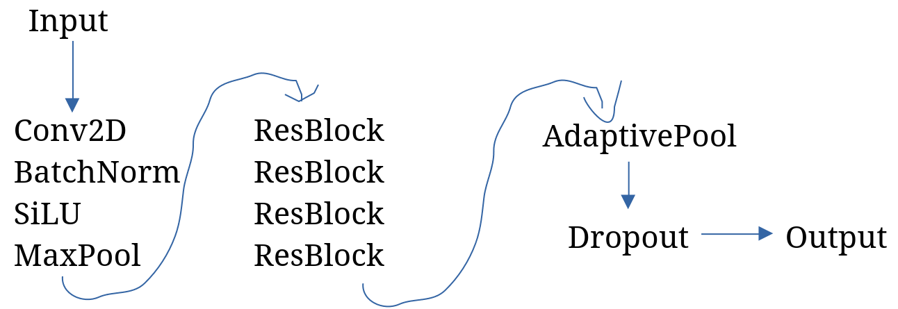
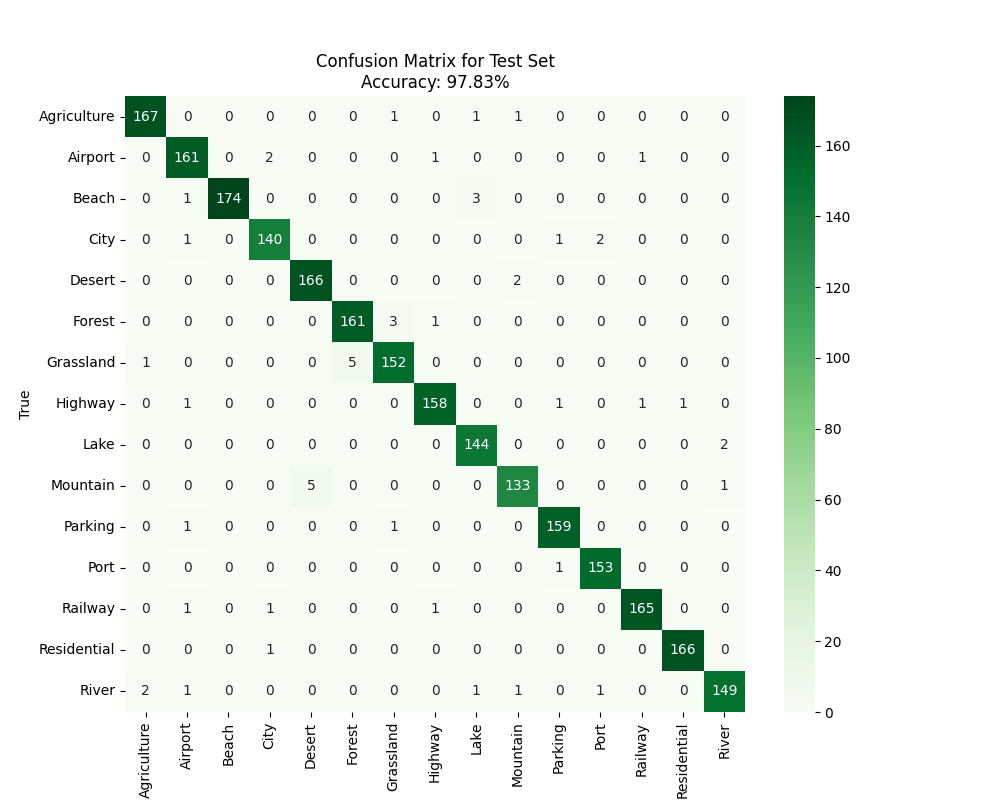

# SEResNet-X

## Intro
SEResNet-X is an image classification model based on ResNet with Squeeze-and-Excitation Blocks and SiLU.

Seems to work fine.

X means there are 10 layers and blocks in total.

Model in `/weights` is trained upon this dataset:

> **Aerial Landscape Images**
> https://www.kaggle.com/datasets/ankit1743/skyview-an-aerial-landscape-dataset

## Specs
|Model|Image size (Pixels)|Accuracy|Params|Flops|
|-|-|-|-|-|
|SEResNet-X-Standard|256x256|~ 97% @epoch=150|4.96M|3.58G|

## Arch
### SEBlock
Input → Linear → SiLU → Linear → Sigmoid → Output
### ResBlock

### Network

## Conf Mat

